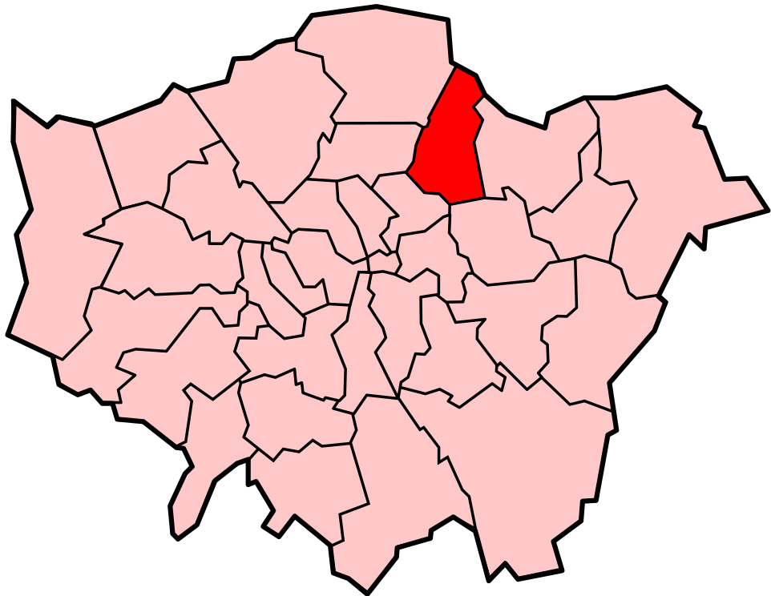

## Background

- Growing commitment in the UK and worldwide to rebalancing the travel system: more walking and cycling.
- There are good for people's physical and mental health, reduce noise and air pollution, reduce the risk of road traffic injury, and help cardiovascular disease and obesity.
- Therefore, there are significant population health gains to be made by moving people into more active modes of travel.
- Social norms and system-based approaches, are understudied in public health. However, these could be key to understanding what makes an intervention successful.
- By norms, we refer to emergent social norms, i.e., behaviour which becomes prevalent through interaction, rather than prescriptive norms (obligation, prohibition, and permission)

## Model aims

- The aim is to build a configurable agent-based model of the *decision* to perform commuting behaviour.
- The intended use of the model is to investigate interventions which seek to destabilize the convention of commuting by car.
- We aim to include the effect of the actions of peers and neighbours, subculture, habit, weather, bicycle ownership, car ownership, environmental supportiveness, and congestion on the decision to travel by walking, cycling, driving, or public transport.
- All the parameters are configurable allowing for other users to calibrate the model to their own area of interest.

# Methods

## Waltham Forest, London

{height="80%"}

Waltham Forest by Morwen and Richtom80 (<https://bit.ly/3yYFzLF>)

## Some assumptions

:::::::::::::: {.columns}
::: {.column width="45%"}
- 4 options at every time step: walk, cycle, public transport, or drive.
- Modelled loosely on Waltham Forest, a North Eastern London Borough.
- Used a microsimulation approach to ensure wards (neighbourhoods) matched real life on things such as car ownership and commute distance. This used data from the UK Household Longitudinal Survey and 2011 Census population data.
:::
::: {.column width="45%"}
{width="80%"}
:::
::::::::::::::

## Environmental assumptions

{width="80%"}

## Agent assumptions

{width="50%"}

## Model initialization

- Agents are created and assigned a range of characteristics:
    * a commute to fulfil (local, city, or beyond);
    * a neighbourhood, social network, and mobility culture; and
    * some psychological variables:
        - suggestibility to friends and neighbours;
        - adherence to norms;
        - inertia/resistance to change; and
        - weather sensitivity.
- Neighbourhoods are assigned a supportiveness and capacity.

## A model run

- Each agent goes to work every weekday.
- Each weekday, each agent calculates a *budget* of how much they are willing to commute by a given mode (norm + habit + congestion). This is then ranked.
- They also calculate a *cost* for each each mode (distance + environmental supportiveness + weather). This is ranked in reverse (higher cost = lower ranked cost).
- Max of budget rank + reverse cost rank.

# Experimentation

## Modelling car-free days

:::::::::::::: {.columns}
::: {.column width="45%"}
- After year 1, cars were banned on Wednesdays. The simulation was run for 4 more years.
- 200 runs.
- More instability.
- More active commutes.
- For every inactive journey, there were 0.091 active journeys (the odds).
- The odds were 77.7% greater in car-free days scenario.
:::
::: {.column width="45%"}
{width="80%" caption="14 day moving average of active commutes"}
:::
::::::::::::::

## Conclusions

- Thinking about norms and habits are key to understanding the decision to commute.
- In our sample intervention, habits and norms allow us to destabilize the convention of commuting by car. We disrupt this convention by preventing the effect of habit (on car-free days); this then leads to a change in norm.
- Further work could extend our model by calibrating the built environment data to see how the environment interacts with social norms.

## End

- Full paper available in the workshop proceedings.
- The model is available under a permissive license at <https://gitlab.com/ragreener1/Motivate>. The specific version used is available at <https://doi.org/hvpd>. It is programmed in Rust, a modern high-performance systems programming language.
- The model is easily configurable using open standards (YAML) to define its parametrization.
- This research was funded by KCL–LSHTM seed funding. Robert Greener is supported by a Medical Research Council Studentship [grant number: MR/N0136638/1]. Steven Cummins is funded by Health Data Research UK (HDR-UK). HDR-UK is an initiative funded by the UK Research and Innovation, Department of Health and Social Care (England) and the devolved administrations, and leading medical research charities.
- Any questions?
